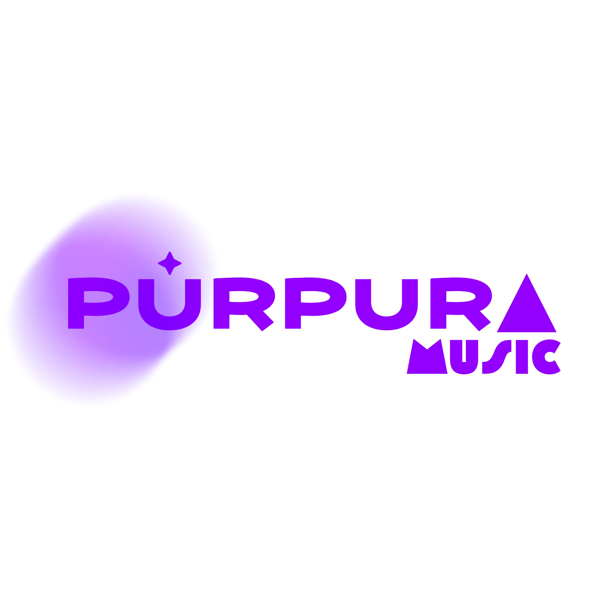

# Púrpura Music

<p align="center">
  
</p>

Púrpura Music is a modern, full-featured music streaming web application built with [Next.js](https://nextjs.org), [Material UI](https://mui.com/), and Tailwind CSS. It offers a beautiful, responsive interface and a seamless music experience across devices.

## 🌐 Public Deployment

Access the live app here: [https://purpuramusic.vercel.app](https://purpuramusic.vercel.app) 

---

## 🚀 Features

- **Authentication & Account Management**
  - Sign up, log in, and log out securely
  - Email verification and password recovery
  - Edit account details and profile picture

- **Personalized Dashboard**
  - Dynamic greeting based on time of day
  - Quick access to top songs, albums, and artists

- **Music Library**
  - Save favorite songs and create playlists (requires login)
  - Browse and play from your personal library

- **Search**
  - Search for songs, artists, and playlists with instant results
  - Debounced input for efficient searching

- **Genre & Artist Pages**
  - Explore music by genre or artist
  - Dedicated pages for albums, artists, and genres

- **Purple Daylist**
  - Curated daily playlist for logged-in users

- **Modern UI/UX**
  - Responsive design for mobile and desktop
  - Animated backgrounds and gradients
  - Custom theming with Material UI and Tailwind CSS

- **Progressive Web App (PWA)**
  - Installable on mobile devices
  - Optimized for offline and standalone use


---

## 🛠️ Getting Started

First, install dependencies:

```bash
npm install
# or
yarn install
```

Then, run the development server:

```bash
npm run dev
# or
yarn dev
# or
pnpm dev
# or
bun dev
```

Open [http://localhost:3000](http://localhost:3000) in your browser to see the app.

---

## 📁 Project Structure

- `app/` – Main Next.js app directory (routing, pages, layouts)
- `lib/` – Server actions, API utilities, and theme configuration
- `store/` – Zustand stores for state management
- `ui/` – Reusable UI components
- `css/` – Custom CSS (animations, effects)
- `public/` – Static assets (images, icons, etc.)

---

## 👤 About the Creator

Created by **Cristian David Vargas Loaiza**  
[LinkedIn](https://www.linkedin.com/in/cristian-david-vargas-loaiza-982314271) | [GitHub](https://github.com/CrisD314159) | [Portfolio](https://crisdev-pi.vercel.app)

---

## 📄 License

This project is for educational and demonstration purposes.

---

## 📦 Deploy on Vercel

The easiest way to deploy your Next.js app is to use [Vercel](https://vercel.com/new?utm_medium=default-template&filter=next.js&utm_source=create-next-app&utm_campaign=create-next-app-readme).

See [Next.js deployment documentation](https://nextjs.org/docs/app/building-your-application/deploying) for